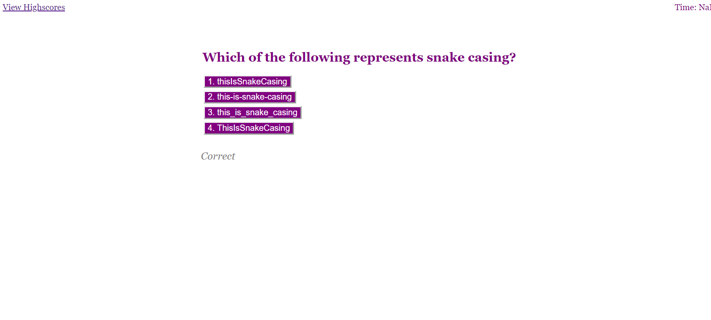

# Code Quiz

## Description
AS A coding bootcamp student
I WANT to take a timed quiz on JavaScript fundamentals that stores high scores
SO THAT I can gauge my progress compared to my peers

Complex HTML & Javascript was written in order to provide a quiz with questions on coding. Each question displays multiple choices and a "correct" or "incorrect" response depending on the option chosen. The quiz features a time countdown, which removes 15 seconds if a question is answered incorrectly. At the end of the quiz, the user is able to see their score, enter their initials, and submit their score to the highscore page. When the "View Highscore" link in the upper lefthand corner is clicked, it will display recent highscores.

## Usage
Here you can find an example of a question with multiple options for answers. Underneath the answers, you will see the prompts displaying if the user chose the correct or incorrect option.

This is the end of the quiz, where the user sees their score and is able to input their initials.  (Note: The score says NaN as I could not figure out how to get the score to display as a number.)

## Installation
To take the coding quiz developed as javascript practice for UNH Coding Bootcamp, click the link here:
https://shannontrainor.github.io/code-quiz/